| Curso | Engenharia de Software |
|---|---|
| Disciplina | Laboratório de Experimentação de Software |
| Turno / Período | Noite / 6º |
| Professor(a) | Danilo Maia |
| Laboratório | Lab01 — Características de Repositórios Populares + Setup do Kanban |
| Grupo (trio) | Arthur Santana · Gabriel Sousa · Pedro Porto |
| Link do repositório / GitHub Projects | https://github.com/gsantss/Laboratorio-de-Experimentacao-de-Software · https://github.com/users/gsantss/projects/2 |
| Data de entrega | Lab01S01: 12/08/2026 · Lab01S02: 19/08/2026 · Lab01S03 + Relatório Final: 26/08/2026 |

---

## 1. Introdução

Sistemas open-source populares são frequentemente citados como referência de boas
práticas de engenharia de software, mas a "popularidade" (medida em estrelas no
GitHub) nem sempre é acompanhada de evidência sistemática sobre maturidade,
nível de contribuição externa, cadência de entrega ou qualidade de manutenção
desses projetos. Este laboratório investiga empiricamente essas características
a partir dos **1.000 repositórios com maior número de estrelas no GitHub**,
coletados via API GraphQL, e utiliza o próprio processo de coleta para dar
início ao uso do **GitHub Projects (Kanban)** que acompanhará o grupo durante
todo o semestre.

As questões de pesquisa do enunciado (70% da exigência) são:

- **RQ01.** Sistemas populares são maduros/antigos? *(idade do repositório)*
- **RQ02.** Sistemas populares recebem muita contribuição externa? *(total de pull requests aceitas)*
- **RQ03.** Sistemas populares lançam releases com frequência? *(total de releases)*
- **RQ04.** Sistemas populares são atualizados com frequência? *(tempo até a última atualização)*
- **RQ05.** Sistemas populares são escritos nas linguagens mais populares? *(linguagem primária)*
- **RQ06.** Sistemas populares possuem alto percentual de issues fechadas? *(razão entre issues fechadas e total de issues)*
- **RQ07.** Sistemas escritos em linguagens mais populares recebem mais contribuição externa, lançam mais releases e são atualizados com mais frequência? *(RQ02, RQ03 e RQ04 segmentadas por linguagem)*

**Hipóteses informais**, formuladas antes da análise completa dos 1.000 repositórios:

| # | Hipótese informal |
|---|---|
| **H01** | A maioria dos repositórios populares será madura/antiga — acumular estrelas exige tempo e descoberta orgânica. |
| **H02** | Mediana alta de PRs aceitas — mais visibilidade tende a atrair mais colaboradores externos. |
| **H03** | Quantidade significativa de releases, dado o ciclo recorrente de entrega esperado em projetos ativos. |
| **H04** | Atualização recente (poucos dias desde a última atualização), por serem projetos ativamente mantidos. |
| **H05** | Predomínio de linguagens de alto ranking de popularidade (ex.: Python, JavaScript/TypeScript). |
| **H06** | Percentual mediano alto de issues fechadas, dada a manutenção ativa esperada. |
| **H07** | Linguagens mais populares recebem mais PRs, releases e atualizações que as demais. |

**Contribuições próprias do grupo (30% de inovação, detalhadas na Metodologia, seção 3.6):**
- Um **dashboard interativo local** (Streamlit) para explorar os dados coletados, com filtros e execução das extrações direto pela interface, com log em tempo real.
- Uma **validação cruzada metodológica** da métrica de RQ02 contra uma segunda fonte independente do GitHub (API REST/Search), que revelou e documentou uma divergência sistemática explicada por uma característica pouco óbvia da própria plataforma (índice de busca *eventually consistent*).

---

## 2. Contexto

Este é o **Lab01**, o primeiro laboratório da disciplina — não há laboratório
anterior do qual os dados dependam, mas o processo de Kanban iniciado aqui
(estrutura de colunas, política de WIP, snapshots do board) será reutilizado e
expandido nos laboratórios seguintes (Lab02 a Lab05), inclusive como fonte de
dados para os Labs 04 e 05, que devem analisar a evolução do próprio processo
do grupo.

O objeto de estudo é o conjunto dos **1.000 repositórios GitHub com maior
número de estrelas** no momento da coleta — um proxy amplamente utilizado na
literatura de mineração de repositórios (*Mining Software Repositories*) para
"projetos open-source de destaque". Como referência conceitual para a
definição de "linguagens mais populares" exigida pela RQ05/RQ07, o grupo adotou
o **TIOBE Index** (https://www.tiobe.com/tiobe-index/, edição de agosto/2026),
mantendo essa mesma fonte ao longo de todo o laboratório, conforme exigido no
enunciado.

---

## 3. Metodologia

### 3.1 Principais Desafios

- **Ordem do processo individual vs. integração.** O enunciado prevê que cada
  integrante implemente e valide sua própria extração (Issue própria, amostra
  de 5-10 repositórios) *antes* de integrar a um script único do grupo. Na
  prática, o script unificado (`scripts/extract_repositories.py`) foi
  construído por um integrante antes que os demais finalizassem suas
  extrações individuais. Isso foi identificado durante o laboratório (a
  partir de uma revisão cruzada entre os integrantes) e corrigido: cada
  integrante passou a também implementar e validar sua extração de forma
  independente (ex.: `extract_rq01_rq02.py`), comparando o resultado com o
  script integrado — as duas implementações produziram valores idênticos,
  o que reforçou a corretude de ambas.
- **Limite de taxa (rate limit) e volume da consulta.** Coletar 1.000
  repositórios com múltiplos campos por repositório exige paginação
  cuidadosa (lotes de 10, cursor do GraphQL) para não estourar o custo de
  consulta por requisição nem o rate limit da API.
- **Ausência de histórico de mudança de status no GitHub Projects.** A API
  do GitHub não expõe um histórico consultável de quando um item mudou de
  coluna no board. A solução adotada foi um **snapshot manual em CSV ao
  final de cada sprint** (`scripts/snapshot_board.py`), reaproveitando a
  mesma técnica de consulta GraphQL da Parte 1.
- **Saturação e pequenas inconsistências no campo `updatedAt` (RQ04).** O
  campo muda a qualquer atividade mínima do repositório (não só push de
  código), fazendo a métrica saturar em 0 dias para a quase totalidade da
  amostra. Adicionalmente, como a coleta dos 1.000 repositórios leva vários
  minutos (100 lotes sequenciais), **105 repositórios apresentaram valor
  negativo (-1 dia)** — o `updatedAt` de repositórios muito ativos avançou
  durante a própria execução da coleta, ultrapassando o instante de
  referência (`collection_date`) fixado no início do script.
- **Distribuições de cauda longa.** Métricas como PRs aceitas e releases têm
  poucos repositórios com valores extremos (ex.: 103.352 PRs aceitas em um
  repositório) e a maioria com valores bem menores — isso exigiu o uso da
  **mediana** (em vez da média) como medida central e escala **logarítmica**
  nos gráficos de distribuição, sob pena de as visualizações ficarem
  ilegíveis.

### 3.2 Tomadas de Decisão

- **Limite de WIP da coluna Doing = 3**, com o grupo sendo um trio: no
  máximo uma tarefa em andamento por integrante simultaneamente, evitando
  acúmulo de trabalho não finalizado e mantendo o ritmo de entrega semanal
  individual previsto no enunciado.
- **Mediana como medida central de referência** para todas as métricas
  numéricas, por ser robusta a outliers — decisão reforçada empiricamente
  pelas distribuições de cauda longa observadas em RQ02 e RQ03.
- **TIOBE Index fixado como fonte única** de "linguagem popular" para RQ05 e
  RQ07, mantida do início ao fim do laboratório, evitando inconsistência de
  critério entre seções do relatório.
- **"Aceita" = `states: MERGED`** na definição operacional de RQ02 (não
  "closed", que incluiria PRs fechadas sem merge) — critério mais fiel ao
  enunciado ("pull requests aceitas").
- **GraphQL em vez de REST** como fonte primária de coleta (exigência do
  enunciado), reservando a API REST/Search apenas como fonte de validação
  cruzada independente (ver seção 3.6).

### 3.3 Etapas

| Sprint | Entregas | Responsável(is) | Issues |
|---|---|---|---|
| **Lab01S01** | Setup do repositório e do GitHub Projects (colunas, WIP); consulta GraphQL para 100 repositórios com todos os campos; validação em amostra de cada dupla de RQs | Gabriel (#1, #2, #4, #6, #8) · Arthur (#3) · Pedro (#5) · todos (#7) | #1–#8 |
| **Lab01S02** | Paginação para 1.000 repositórios + exportação em CSV; validação individual da consistência de cada RQ nos 1.000 (distribuição, outliers, ausentes); hipóteses informais; primeiro snapshot do board | Gabriel (#15, #17) · Arthur (#16, #19) · Pedro (#18, #20) | #15–#20 |
| **Lab01S03 + Relatório Final** | Dashboard interativo de visualização (inovação do grupo); elaboração do relatório final; slides de apresentação | Arthur (#26) · Pedro (#28) · Gabriel (slides) | #26, #28 |

#### Configuração do processo

- **Ferramenta:** GitHub Projects (v2), vinculado ao repositório do grupo.
- **Colunas do board (Status):** `Backlog → Todo → In Progress → Review → Done`.
- **Cartões:** exclusivamente Issues reais do repositório (sem *draft issues*), cada uma atribuída a um responsável (campo Assignee).
- **Limite de WIP (coluna Doing/In Progress):** 3 — ver justificativa na seção 3.2.
- **Rastreabilidade:** cada commit referencia o número da Issue correspondente (ex.: `#16 valida RQ01 e RQ02 nos 1000 repositórios`), permitindo que o GitHub vincule automaticamente commit ↔ Issue no histórico.

> Print do quadro Kanban (GitHub Projects) ao final do Lab01 — ver Anexo, ao final deste documento.

### 3.4 Ferramentas

- **Coleta de dados:** API GraphQL do GitHub, consumida por script próprio do grupo (`scripts/extract_repositories.py`), em Python puro (biblioteca padrão `urllib`), sem bibliotecas de terceiros de acesso à API, conforme exigido.
- **Processamento e análise:** Python 3, Pandas e a biblioteca padrão `statistics` (estatísticas descritivas e outliers via IQR).
- **Visualização:** Matplotlib (gráficos deste relatório) e Plotly, integrado ao dashboard interativo (ver seção 3.6).
- **Dashboard:** Streamlit (`scripts/dashboard.py`).
- **Processo:** GitHub Projects (v2) — https://github.com/users/gsantss/projects/2 — e GitHub CLI (`gh`) para automações de Issues/board.

### 3.5 Tabela de Métricas

| RQ | Métrica | Definição Operacional | Unidade | Ferramenta / Fonte |
|---|---|---|---|---|
| RQ01 | Idade do repositório | Data de coleta − `createdAt` | Dias / anos | Script GraphQL (API do GitHub) |
| RQ02 | Contribuição externa | `pullRequests(states: MERGED).totalCount` | Contagem | Script GraphQL (API do GitHub) |
| RQ03 | Releases | `releases.totalCount` | Contagem | Script GraphQL (API do GitHub) |
| RQ04 | Frequência de atualização | Data de coleta − `updatedAt` | Dias | Script GraphQL (API do GitHub) |
| RQ05 | Linguagem primária | `primaryLanguage.name` | Categórica | Script GraphQL (API do GitHub) + TIOBE Index |
| RQ06 | % de issues fechadas | `issues(states: CLOSED).totalCount / issues.totalCount × 100` | % | Script GraphQL (API do GitHub) |
| RQ07 | RQ02/RQ03/RQ04 por linguagem | Mediana de cada métrica, agrupada por `primaryLanguage.name` | Contagem/dias por grupo | Pandas (`groupby` sobre os dados de RQ02-05) |

### 3.6 Inovações Propostas pelo Grupo (30% da nota)

**(1) Dashboard interativo local (Streamlit).** Além dos scripts de linha de
comando exigidos pelo enunciado, o grupo desenvolveu um dashboard local
(`scripts/dashboard.py`) que unifica a visualização dos dados de RQ01–RQ06 em
uma única interface: filtros por faixa de estrelas e linguagem, uma aba por
questão de pesquisa com gráficos interativos (Plotly), e um botão que executa
`extract_repositories.py` diretamente pela interface, exibindo o log de
execução em tempo real (numa caixa com scroll, sem precisar do terminal). É
uma mudança de arquitetura de visualização em relação ao enunciado (que pede
apenas discussão dos valores obtidos): o resultado aparece na seção 4.2
(gráficos deste relatório foram conferidos visualmente contra o dashboard) e é
retomado na Conclusão como ferramenta a expandir nos próximos laboratórios.

**(2) Validação cruzada metodológica de RQ02.** Além da validação de
consistência exigida pelo enunciado (valores ausentes/outliers via IQR), o
grupo comparou manualmente uma amostra de repositórios entre o valor de PRs
aceitas obtido via GraphQL e o valor equivalente obtido pela API de busca do
GitHub (`/search/issues?q=...+is:merged`). Em **100% dos casos testados**, o
valor via GraphQL foi maior que o da busca — nunca menor, nunca igual — um
padrão sistemático que não é explicado por "mais PRs terem sido aceitas depois
da comparação" (isso não teria direção fixa), mas sim porque **o índice de
busca do GitHub é *eventually consistent*** (atualiza com atraso), enquanto o
campo `totalCount` do GraphQL lê o estado real do banco. Esse achado
metodológico — não pedido pelo enunciado — reforça a confiabilidade da fonte
de dados escolhida (GraphQL) e é retomado na discussão da RQ02 (seção 4.3).

---

## 4. Resultados

Valores calculados sobre os **1.000 repositórios** coletados (100% da amostra-alvo).

### 4.1 Coleta de Dados

- **1.000 de 1.000** repositórios-alvo coletados com sucesso, via paginação em
  100 lotes de 10, sem falhas de requisição.
- **RQ01/RQ02/RQ03:** 1.000/1.000 observações válidas, 0 valores ausentes, 0
  valores inválidos (idade ou contagens negativas).
- **RQ04:** 105 repositórios com valor levemente negativo (-1 dia — ver
  "Principais Desafios", 3.1); tratados como equivalentes a "0 dias" na
  análise, não removidos.
- **RQ05:** 913/1.000 com linguagem primária identificada; **87 repositórios
  (8,7%) sem linguagem** (coleções tipo *awesome*/documentação, sem código
  predominante) — mantidos na amostra, mas excluídos da análise de RQ05/RQ07.
- **RQ06:** 957/1.000 com issues habilitadas; **43 repositórios (4,3%)** sem
  nenhuma issue registrada, percentual indefinido — excluídos apenas dessa RQ.
- **Outliers (RQ02, método IQR):** identificados e listados (ex.:
  `kubernetes/kubernetes`, `microsoft/vscode`, `tensorflow/tensorflow`) — não
  removidos da amostra, pois representam repositórios populares legítimos, e
  sua presença é justamente o que caracteriza a distribuição de cauda longa
  discutida na RQ02.

### 4.2 Visualização Gráfica

**RQ01 — Sistemas populares são maduros/antigos?**

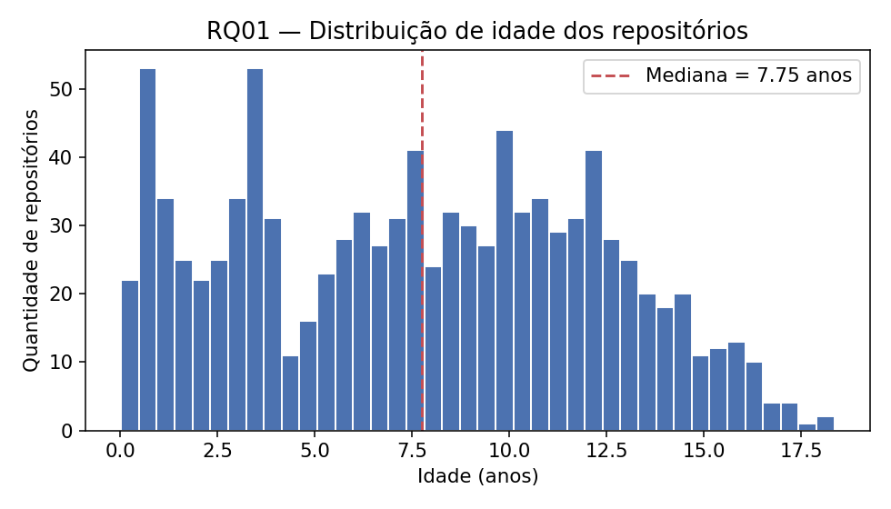

Idade mediana de **7,75 anos** (mín. 0,02; máx. 18,35 anos), com 628
repositórios (62,8%) entre 5 e 15 anos.

**RQ02 — Sistemas populares recebem muita contribuição externa?**

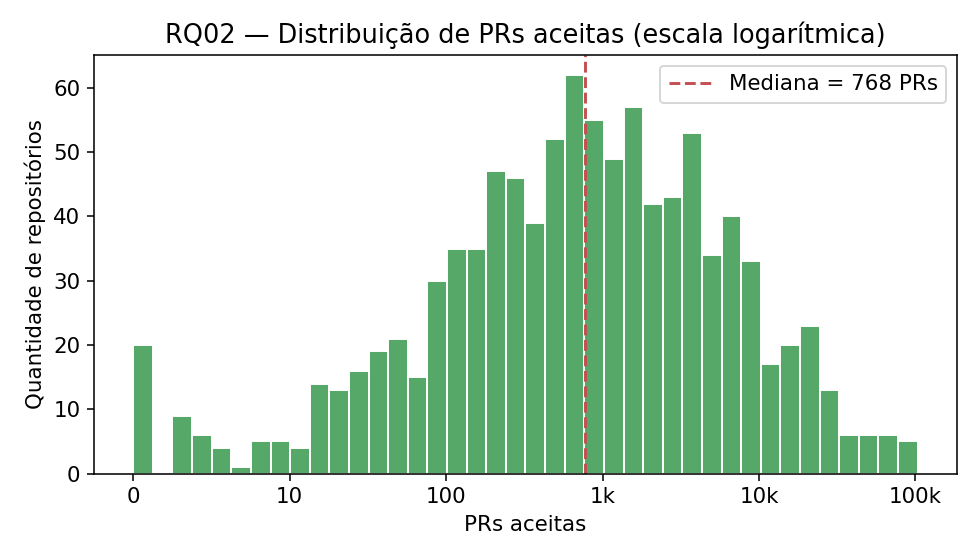

Mediana de **768 PRs aceitas** (escala logarítmica no eixo X, pois a média —
4.236,92 — e o máximo — 103.352 — revelam forte assimetria).

**RQ03 — Sistemas populares lançam releases com frequência?**

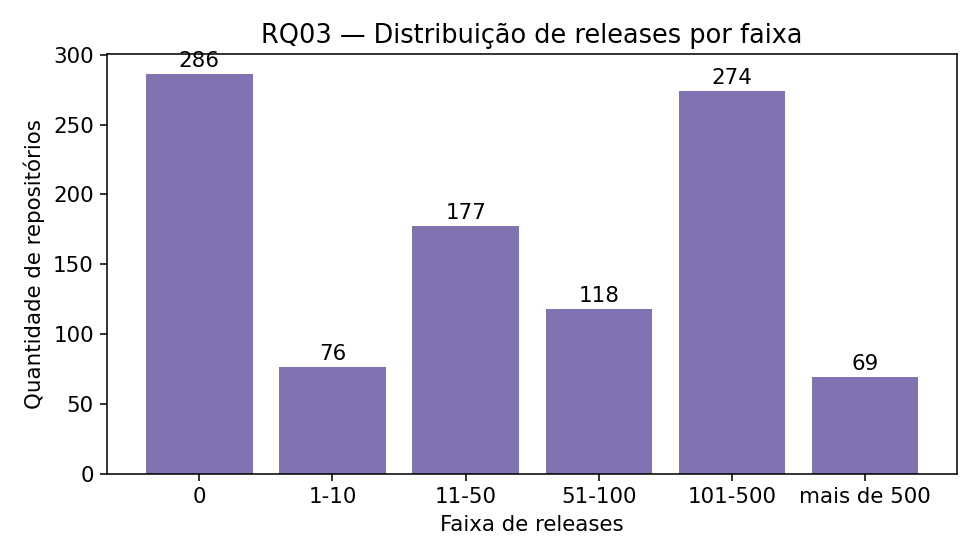

Mediana de **39 releases**, mas **286 repositórios (28,6%) não têm nenhuma
release** registrada.

**RQ04 — Sistemas populares são atualizados com frequência?**

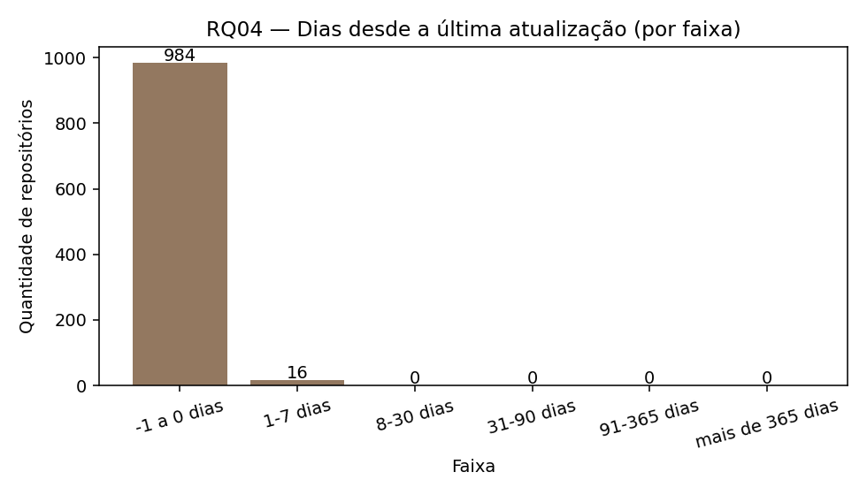

Mediana de **0 dias** — 98,4% dos repositórios com `updatedAt` no dia da
coleta (ou levemente anterior, ver 3.1/4.1). A métrica satura e discrimina
pouco (ver discussão, 4.3).

**RQ05 — Sistemas populares são escritos nas linguagens mais populares?**

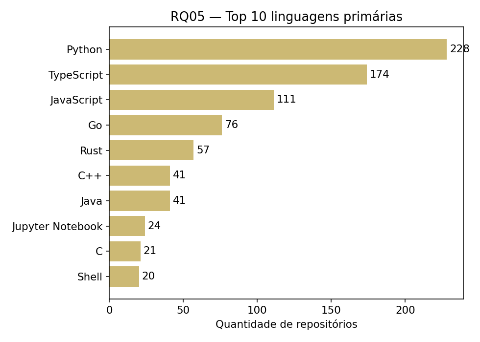

**Python** lidera com 228 repositórios (22,8% da amostra com linguagem
identificada), seguido de **TypeScript** (174) e **JavaScript** (111).

**RQ06 — Sistemas populares possuem alto percentual de issues fechadas?**

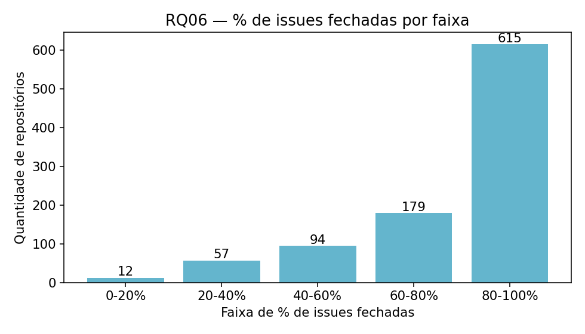

Mediana de **87,57%** de issues fechadas; 615 repositórios (64,3% dos válidos)
fecham entre 80% e 100% das issues.

**RQ07 — Linguagens populares recebem mais contribuição, releases e atualização?**

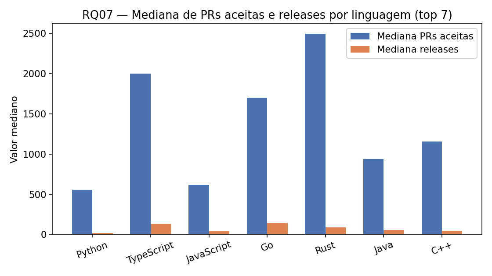

TypeScript, Rust e Go apresentam medianas de PRs aceitas e releases **maiores**
que Python, a linguagem mais frequente da amostra — contribuição não
acompanha frequência de uso.

### 4.3 Discussão

| Hipótese | Resultado observado | Veredito |
|---|---|---|
| **H01** | Idade mediana de 7,75 anos; 62,8% entre 5–15 anos; 0 outliers (IQR) | **Confirmada** |
| **H02** | Mediana de 768 PRs aceitas; distribuição de cauda longa | **Confirmada** |
| **H03** | Mediana de 39 releases, mas 28,6% com 0 releases | **Parcialmente confirmada** |
| **H04** | Mediana de 0 dias, mas métrica satura (`updatedAt`) | **Confirmada com ressalva** |
| **H05** | Python = líder e #1 no TIOBE; 66,8% no top 20; TypeScript fora do TIOBE | **Parcialmente confirmada** |
| **H06** | Mediana de 87,57% de issues fechadas | **Confirmada** |
| **H07** | TypeScript/Rust/Go superam Python em PRs e releases | **Parcialmente confirmada** |

**RQ01.** A hipótese H01 foi confirmada: acumular popularidade exige tempo, e
os dados mostram concentração clara entre 5 e 15 anos, com quase nenhum
projeto muito recente entre os mais populares.

**RQ02.** A hipótese H02 foi confirmada — mediana alta de contribuição
externa —, mas com a ressalva de que a **média é enganosa** nessa métrica
(4.236,92, distorcida por poucos repositórios extremos); a mediana é a medida
correta para caracterizar o repositório "típico". A validação cruzada
metodológica (inovação 2, seção 3.6) reforça a confiança nesse resultado: o
valor via GraphQL foi consistentemente maior que uma fonte alternativa
(busca), num padrão explicado por *eventual consistency* do índice de busca, e
não por erro de coleta.

**RQ03.** H03 apenas parcialmente confirmada: 28,6% dos repositórios não usam
o mecanismo de Releases do GitHub — provavelmente distribuindo por
gerenciadores de pacotes (npm, PyPI) ou por tags Git simples, ou sendo
coleções sem artefato versionado. Investigação futura: cruzar com tags Git e
normalizar releases pela idade do projeto.

**RQ04.** H04 confirmada apenas com ressalva relevante: o campo `updatedAt`
muda a qualquer atividade (incluindo receber uma estrela), não só push de
código, e satura em 0 para quase toda a amostra — não permite distinguir
projeto ativo de inativo com segurança. Uma reanálise com `pushedAt` (data do
último push de código) é recomendada para conclusões mais robustas.

**RQ05.** H05 parcialmente confirmada: Python lidera tanto na amostra quanto
no TIOBE, e 66,8% dos repositórios com linguagem usam uma linguagem do top 20
do TIOBE. Porém, TypeScript — a 2ª linguagem mais comum na amostra — não
aparece no top 20 do TIOBE, evidenciando que **"popularidade" diverge conforme
a fonte**: o TIOBE mede buscas na web em geral, enquanto o GitHub reflete o
uso real em projetos open-source.

**RQ06.** H06 confirmada: percentual mediano alto (87,57%) é coerente com
projetos de manutenção ativa e triagem contínua de issues.

**RQ07.** H07 parcialmente confirmada — na direção oposta à intuição inicial:
a linguagem mais frequente (Python) **não** é a mais "ativa" por essas
métricas; TypeScript, Rust e Go superam-na em mediana de PRs e releases. Isso
sugere que atividade de contribuição está mais ligada ao **tipo de ecossistema**
(web, sistemas) do que à popularidade pura da linguagem.

**Ameaças à validade.** (i) A amostra é definida por estrelas num único
instante de coleta — não captura popularidade histórica nem exclui projetos
que "explodiram" recentemente por motivos pontuais (viral, lançamento). (ii)
`updatedAt` (RQ04/RQ07) é uma métrica de baixa granularidade, conforme
discutido. (iii) A definição de "linguagem popular" depende da fonte externa
escolhida (TIOBE), que mede um universo mais amplo que apenas repositórios
open-source populares — como a própria RQ05 evidencia.

---

## 5. Conclusão

Os dados sustentam fortemente que repositórios populares do GitHub são
**maduros** (RQ01), recebem **contribuição externa relevante e consistente**
(RQ02) e mantêm **alto percentual de issues fechadas** (RQ06) — as três
hipóteses mais robustamente confirmadas, sem ambiguidade metodológica
relevante. As demais hipóteses (RQ03, RQ04, RQ05 e RQ07) precisam de
qualificação: nem todo projeto popular usa o mecanismo de Releases do GitHub
(RQ03); a métrica de atualização escolhida satura e não discrimina bem
atividade real (RQ04); a "popularidade de linguagem" depende de qual fonte
externa se usa como referência (RQ05); e a linguagem mais frequente não é
necessariamente a que recebe mais contribuição (RQ07).

**Limitações do estudo:** amostra de um único instante de coleta (sem série
temporal); métrica de atualização (`updatedAt`) de baixa granularidade;
dependência de uma única fonte externa (TIOBE) para "linguagem popular".

As duas inovações propostas pelo grupo (seção 3.6) agregaram valor além do
exigido: o **dashboard interativo** torna a exploração dos dados acessível sem
reprocessamento manual, e será expandido nos próximos laboratórios (ex.: para
visualizar os snapshots do Kanban); a **validação cruzada metodológica** de
RQ02 aumentou a confiança na fonte de dados escolhida e revelou uma
característica não-óbvia da plataforma (consistência eventual do índice de
busca), que vale a pena documentar como boa prática para os próximos
laboratórios do grupo. Com mais tempo, o grupo investigaria RQ04 usando
`pushedAt` em vez de `updatedAt`, e aplicaria testes estatísticos formais
(ex.: Kruskal-Wallis) para validar as diferenças por linguagem observadas na
RQ07.

---

## Referências

- ZUSE, Horst. *A framework of software measurement*. Walter de Gruyter, 2013.
- GITHUB, Inc. *GitHub GraphQL API documentation*. Disponível em: https://docs.github.com/en/graphql. Acesso em: ago. 2026.
- TIOBE Software. *TIOBE Index*. Disponível em: https://www.tiobe.com/tiobe-index/. Acesso em: ago. 2026.
- STREAMLIT Inc. *Streamlit documentation*. Disponível em: https://docs.streamlit.io/. Acesso em: ago. 2026.

---

## Anexo — Print do board e fluxo completo do Lab01

Capturas do GitHub Projects (v2) do grupo ao final do Lab01, mostrando as
colunas do Kanban (Backlog → Todo → In Progress → Review → Done) e os
cartões concluídos ao longo das sprints (as quatro imagens seguem a rolagem
da coluna Done, que concentra os itens já finalizados):

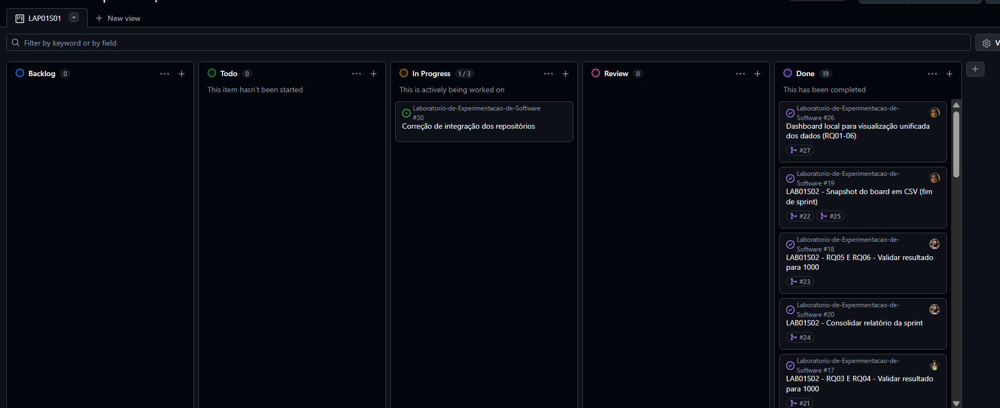

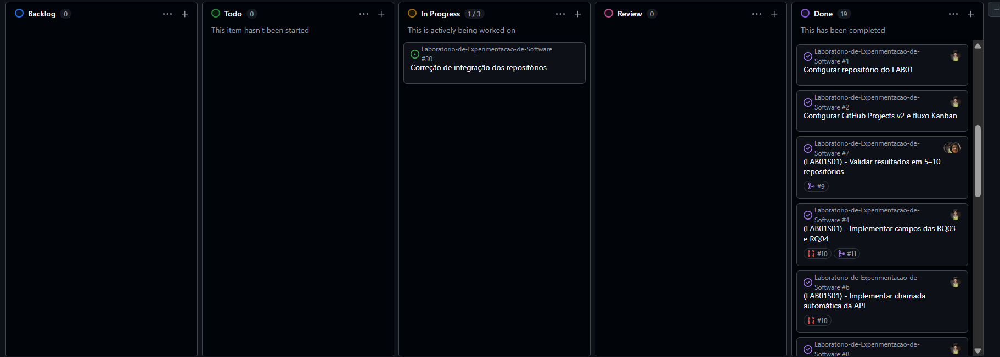

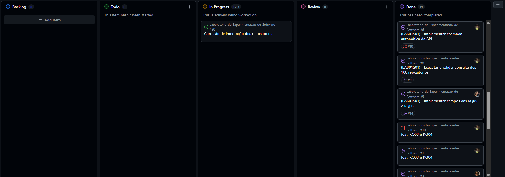

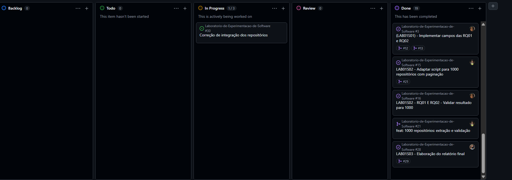
